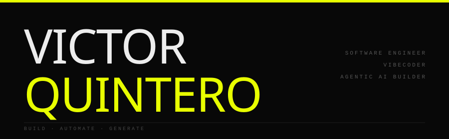

  &nbsp;&nbsp;&nbsp;&nbsp;&nbsp;&nbsp;&nbsp;&nbsp;
  &nbsp;&nbsp;&nbsp;&nbsp;&nbsp;&nbsp;&nbsp;&nbsp;
  

I build tools at the intersection of code and generative AI — agentic applications, ComfyUI-powered media pipelines, and developer frameworks. If a workflow can be automated with AI, I'll wrap it in an agent or a skill.

 

Systems where LLMs don't just generate text — they take actions, call tools, and complete multi-step tasks autonomously.

- **Skill-based agents** — composable tools/skills that give LLMs real capabilities
- **Agentic apps** — full-stack applications where an agent is the core runtime (see [aurora](https://github.com/quinteroac/aurora))
- **Spec-driven development** — structured specs to guide agents through complex tasks ([nvst](https://github.com/quinteroac/nerds-vibecoding-survivor-toolkit))

`Mastra` · `Vercel AI SDK` · `Assistant UI` · `GitHub Copilot SDK` · `MCP` · `ElysiaJS / Bun`

 

| | |
|:---|:---|
| **[zikon](https://github.com/quinteroac/zikon)** | CLI for generating icons & SVG assets from text prompts via diffusion models — installable as an agent skill |
| **[aurora](https://github.com/quinteroac/aurora)** | Agentic RPG — Mastra agent narrates, builds world & generates media in real time |
| **[comfy-diffusion](https://github.com/quinteroac/comfy-diffusion)** | Python library exposing ComfyUI's inference engine as importable modules — no server needed |
| **[nerds-vibecoding-survivor-toolkit](https://github.com/quinteroac/nerds-vibecoding-survivor-toolkit)** | Spec-driven agentic development framework & CLI built on Bun |
| **[ComfyUI_ComfyAssistant](https://github.com/quinteroac/ComfyUI_ComfyAssistant)** | Natural language agent to control & explore ComfyUI workflows |
| **[ComfyUI_DSS_Wrapper](https://github.com/quinteroac/ComfyUI_DSS_Wrapper)** | DiffSynth Studio wrapper — zero-shot image-to-LoRA nodes |
| **[comfyui_api_executor_nodes](https://github.com/quinteroac/comfyui_api_executor_nodes)** | Custom nodes for ComfyUI workflow execution via API |
| **[mushin-ai](https://github.com/quinteroac/mushin-ai)** | Minimal AI-powered notepad / second brain |
| **[niji-prompt-generator](https://github.com/quinteroac/niji-prompt-generator)** | Browser extension for generating Midjourney prompts via OpenAI |
| **[comfyui-base-image](https://github.com/quinteroac/comfyui-base-image)** | Docker container for running ComfyUI on RunPod |
| **[datasets-toolbox](https://github.com/quinteroac/datasets-toolbox)** | Utility toolkit for managing AI training datasets |

 

`Python` · `TypeScript` · `Bun` · `ElysiaJS` · `React` · `ComfyUI` · `Docker` · `OpenAI API` · `Anthropic API` · `Mastra` · `Vercel AI SDK` · `Assistant UI` · `GitHub Copilot SDK` · `MCP` · `LoRA / DiffSynth` · `RunPod`

 

- Building Aurora — agentic RPG with Mastra, Assistant UI & comfy-diffusion media pipeline
- MCP servers and agent skill distribution
- Audio-video generation pipelines — WAN 2.1, LTXV, ACE Step
- Reproducible ComfyUI environments on RunPod

 

&nbsp;&nbsp;

 

&nbsp;&nbsp;